# ratxen-readme-blogs
# Parallel Creation of WEB vs NATIVE REACT APP

---

## React JS Steps

### Installation

> C:\Users\jns\Desktop\2\dev>npx create-react-app learn-reactjs

> C:\Users\\jns\Desktop\2\dev>cd learn-reactjs

> C:\Users\\jns\Desktop\2\dev\learn-reactjs>yarn start

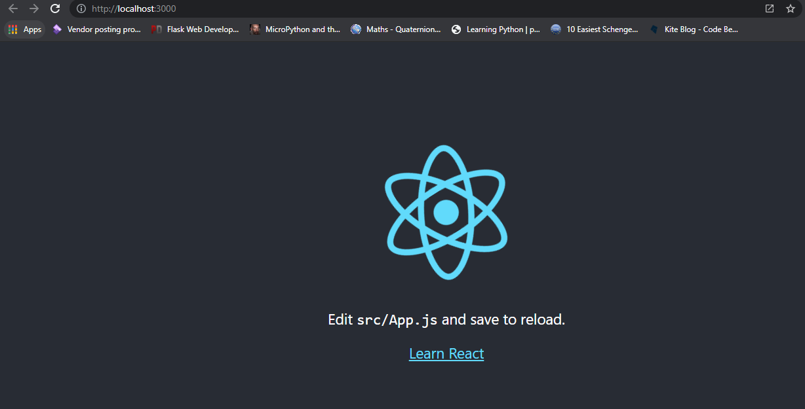

### Comparison 1 : Basic Comparison - Running the Initial App

*React JS project the top most parent is index.js file .*

*Then App and then further you can create as per your wish . To make it comparable with the expo RN ( React Native ) Project we are keeping the structure App.js > has children > Main.js.*

* [ ] Folder Structure

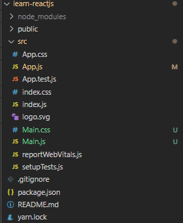

* [ ] Index.js file

```bash
import React from 'react';
import ReactDOM from 'react-dom';
import './index.css';
import App from './App';
import reportWebVitals from './reportWebVitals';

ReactDOM.render(
  <React.StrictMode>
    <App />
  </React.StrictMode>,
  document.getElementById('root')
);

// If you want to start measuring performance in your app, pass a function
// to log results (for example: reportWebVitals(console.log))
// or send to an analytics endpoint. Learn more: https://bit.ly/CRA-vitals
reportWebVitals();
```

* [ ] App.js file

```bash
import Main from "./Main";

function App(){
  return(
    <Main/>
  );
}

export default App;
```

* [ ] Main.css

```bash
.container{
    flex: 1;
    background-color: '#fff';
    align-items: 'center';
    justify-content: 'center';
    text-align: center;
}
```

* [ ] Main.js file

```bash
import React from 'react';
import './Main.css';

function Main(){
    return(
        <div className="container">
            <p>Open up App.js to start working on your app! [REACT JS FOR WEB]</p>
        </div>
    );

}

export default Main;
```

* [ ] Browser http://localhost:3000/

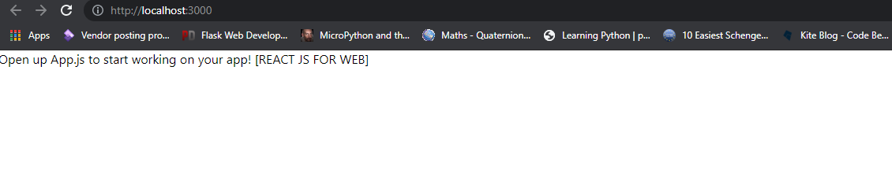

after addition of little css properties through Main.css

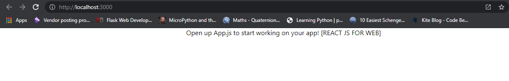

*🎉️ 😄 We have successfully did the exact replica of what we have written in web vs native mobile.*

---

---

## React Native Steps

### Installation

This page will help you install and build your first React Native app.

**If you are new to mobile development**, the easiest way to get started is with Expo CLI. Expo is a set of tools built around React Native and, while it has many [features](https://expo.io/features), the most relevant feature for us right now is that it can get you writing a React Native app within minutes. You will only need a recent version of Node.js and a phone or emulator. If you'd like to try out React Native directly in your web browser before installing any tools, you can try out [Snack](https://snack.expo.dev/).

> C:\Users\\jns\Desktop\2\dev>npm install -g expo-cli

> C:\Users\jns\Desktop\2\dev>expo init learn-reactnative

> C:\Users\jns\Desktop\2\dev>cd learn-reactnative

> C:\Users\\jns\Desktop\2\dev\learn-reactnative>yarn start
>
> `# you can also use: expo start`

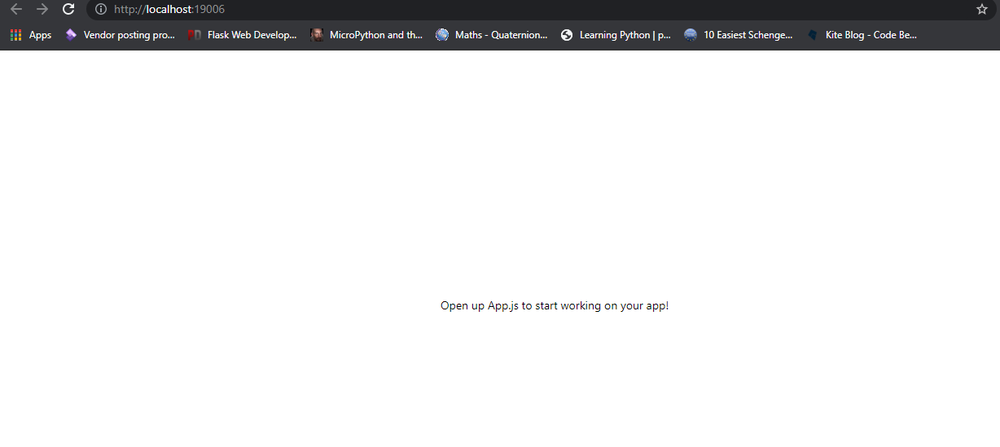

### Comparison 1 : Basic Comparison - Running the Initial App

* [ ] Folder Structure

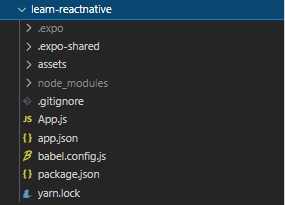

* [ ] Index.js is not there when we run the RN through Native . Rather than there is expo folder which is directly connected to App.js. Very similar functionality is in React Native CLI option where the app registry is there.

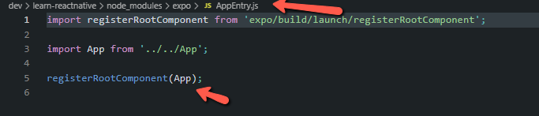

* [ ] App.js

```bash
import React from 'react';
import Main from './Main';


export default function App(){
  return(
    <Main/>
  );
}
```

* [ ] Main.js

```bash
import { StatusBar } from 'expo-status-bar';
import React from 'react';
import { StyleSheet, Text, View } from 'react-native';

export default function Main() {
  return (
    <View style={styles.container}>
      <Text>Open up App.js to start working on your app! [REACT NATIVE FOR MOBILE ] </Text>
      <StatusBar style="auto" />
    </View>
  );
}

const styles = StyleSheet.create({
  container: {
    flex: 1,
    backgroundColor: '#fff',
    alignItems: 'center',
    justifyContent: 'center',
  },
});

```

* [ ] Browser output

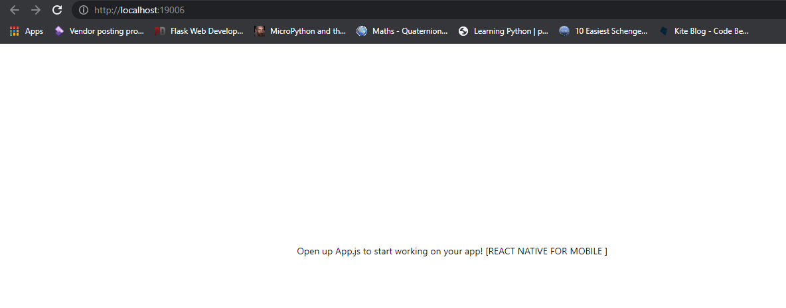

*🎉️ 😄 We have successfully did the exact replica of what we have written in web vs native mobile.*

*Till the next comparison - let's understand the basic points -*

1. Comparison between different interfaces -

<View><View>  <div> `<div></div> = <View></View>`

`<p></p> = <Text></Text>`

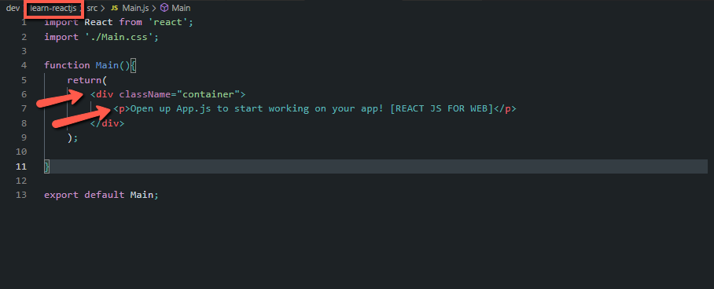

RN - 

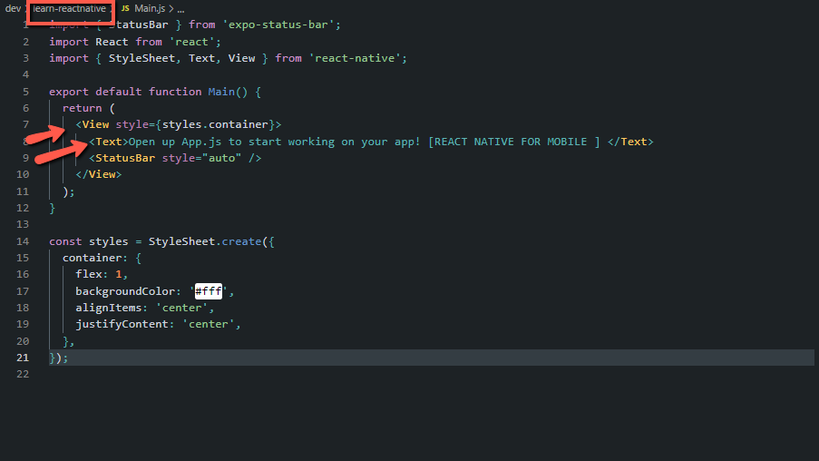


[Overall picture from react Native documentation-](https://reactnative.dev/docs/intro-react-native-components)


| REACT NATIVE UI COMPONENT | ANDROID VIEW | IOS VIEW | WEB ANALOG | DESCRIPTION |
| - | - | - | - | - |
| `<View>` | `<ViewGroup>` | `<UIView>` | A non-scrollling`<div>` | A container that supports layout with flexbox, style, some touch handling, and accessibility controls |
| `<Text>` | `<TextView>` | `<UITextView>` | `<p>` | Displays, styles, and nests strings of text and even handles touch events |
| `<Image>` | `<ImageView>` | `<UIImageView>` | `` | Displays different types of images |
| `<ScrollView>` | `<ScrollView>` | `<UIScrollView>` | `<div>` | A generic scrolling container that can contain multiple components and views |
| `<TextInput>` | `<EditText>` | `<UITextField>` | `<input type="text">` | Allows the user to enter text |

2. Styles were created in raw css formats but if you look on the RN part - they are using the Stylesheets to create the styles in the RN. further styles were using exactly JSX syntax rather than normal css style as contrast to the React Web JS.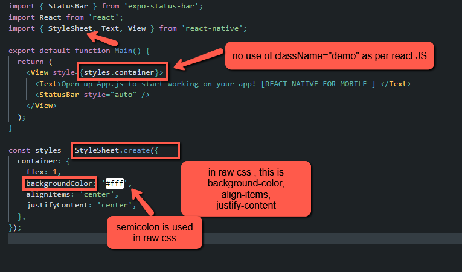

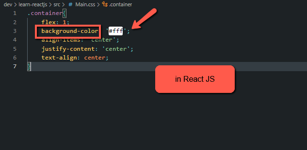

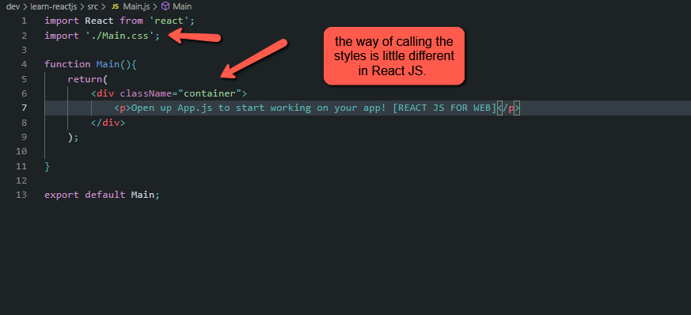

tc . do star this git.

we will slowly build a good application side by side with proper comparison between RN ( React Native JS ) and RW ( React Web JS ).

😄 🎉️
